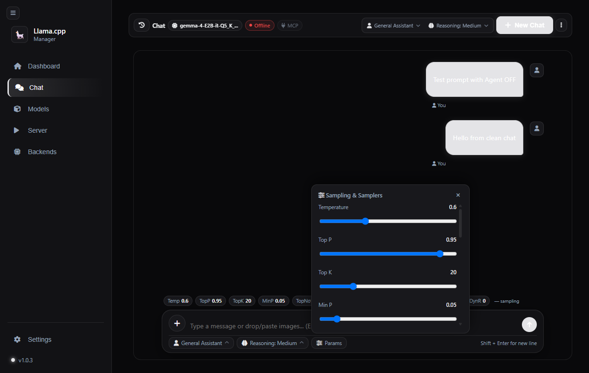
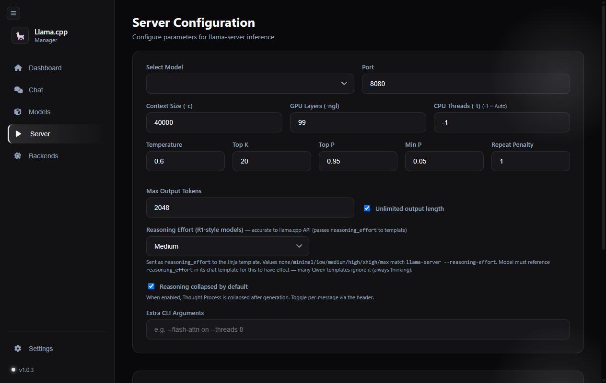

<div align="center">

# Llama.cpp Manager

**A high-performance cross-platform desktop GUI for downloading, configuring, and running [llama.cpp](https://github.com/ggml-org/llama.cpp) locally — no terminal required.**

Built with Electron, works on **Windows** and **Linux**.


[](LICENSE)

[](https://github.com/bunnywaffle/Llama-cpp-manager/releases/latest)
[](https://www.electronjs.org/)

</div>

---

## 🚀 What is it?

Llama.cpp Manager is a sleek, modern desktop workstation for local LLM inference powered by [llama.cpp](https://github.com/ggml-org/llama.cpp) and `llama-server`. It eliminates command-line complexity while providing deep control over hardware, speculative decoding, and sampling architectures:

- **Automated Backend Setup**: One-click install and update of official llama.cpp releases (CUDA, Vulkan, CPU) or link any existing build.
- **Speculative Decoding Suite**: Full native support for **DSpark**, **MTP**, **DFlash**, and **EAGLE3** drafters with GGUF architecture validation.
- **CPU & GPU Performance Tuning**: Hardware controls for CPU threads (`-t`), GPU layer offloading (`-ngl`), context length (`-c`), and flash attention (`-fa`).
- **Integrated Chat Studio**: Beautiful streaming chat with message branch editing, persona roleplay systems (lorebooks, greetings), and multimodal image vision.
- **Full Sampling Suite**: Real-time sliders for Min P, Top P, Top K, Temperature, XTC probability, DRY sequence breakers, Mirostat, and Dynatemp.
- **LoRA Adapter Management**: Dynamic LoRA scaling sliders, multi-adapter chaining, and base model compatibility protection.
- **MCP Tool Integration**: Authentic Cursor-compatible stdio `mcp.json` tool execution with real-time chat widget rendering.

---

## 📸 Screenshots

| Dashboard & Hardware Controls | Integrated Chat & Sampling Popover |
|:---:|:---:|
|  |  |
| *Live server metrics, CPU threads (-t), context, and quick controls* | *Streaming chat, branching edits, and live Min P sampling popover* |

| Models & Speculative Drafters | Server & Hardware Configuration |
|:---:|:---:|
|  |  |
| *GGUF library with DSpark, MTP, DFlash drafters, and LoRAs* | *CPU threads (-t), GPU layers (-ngl), context size, and samplers* |

| Backend Manager & Release Switcher |
|:---:|
|  |
| *Multiple installed backends with 1-click switching and automatic missing-file repair* |

---

## ✨ Key Features

- ⚡ **Speculative Decoding with DSpark & MTP** — Link companion drafter models with automatic GGUF architecture inspection and family mismatch safety guards.
- 🧵 **CPU Threads Control (`-t` / `--threads`)** — Tune generation threads on both the Dashboard and Server settings to prevent CPU oversaturation and boost token generation speed by **2x–4x** per official llama.cpp performance guidelines.
- 🎛️ **Quick Chat Sampler Popover** — Instantly adjust Min P, Temperature, Top P, Top K, Repeat Penalty, XTC, and DRY multiplier directly from the chat input bar.
- 🧠 **Dynamic LoRA Adapters** — Add, scale, enable, or disable LoRA adapters on the fly with base variant mismatch protection.
- 🎭 **Persona & Roleplay Engine** — Create custom personas with starting greetings, dialogue examples, and keyword-triggered lorebook injection.
- 🛠️ **MCP (Model Context Protocol)** — Run stdio MCP servers with automatic parameter exposure and chat tool call visualizers.
- 🎨 **Modern Themes** — Super Dark Mono, Midnight, Slate, Dark, and Light themes with customizable accent colors.
- 🪟 **Self-Contained & Portable** — Standalone Windows executable with portable data storage options.

---

## ⬇️ Installation

Download the latest portable executable from the **[Releases](https://github.com/bunnywaffle/Llama-cpp-manager/releases)** page:

1. Download **`Llama.cpp.Manager.1.0.3.exe`** from [Latest Release](https://github.com/bunnywaffle/Llama-cpp-manager/releases/latest).
2. Run the executable anywhere — no setup wizard or registry modifications required.
3. Open **Backends** to install the latest llama.cpp build (or link your existing installation).
4. Point the app to your GGUF models folder in **Models** and start generating!

---

## 🛠️ Development

### Install dependencies

```bash
npm install
```

### Run from source

```bash
npm start
```

### Build portable package

```bash
npm run build-portable
```

---

## 📄 License

This project is licensed under the [MIT License](LICENSE).