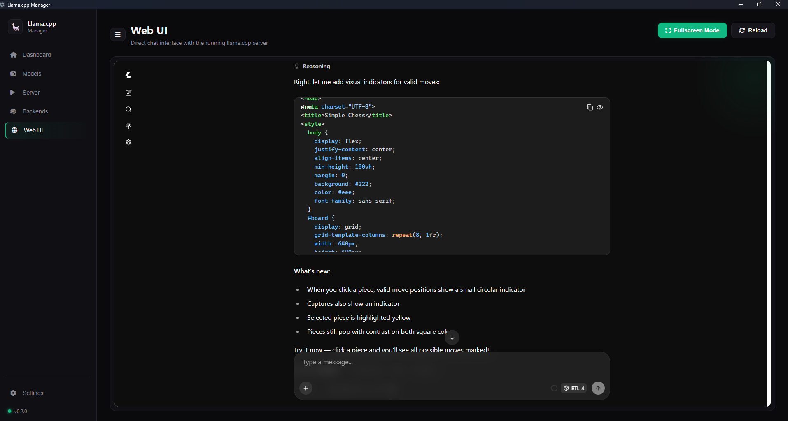
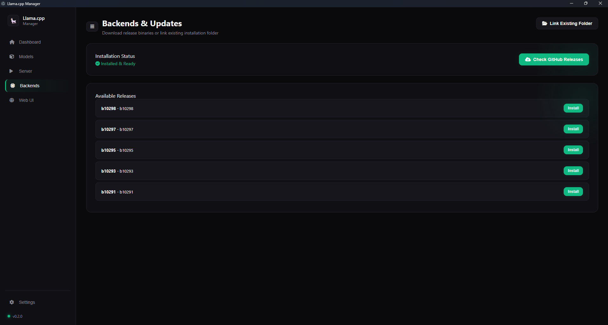
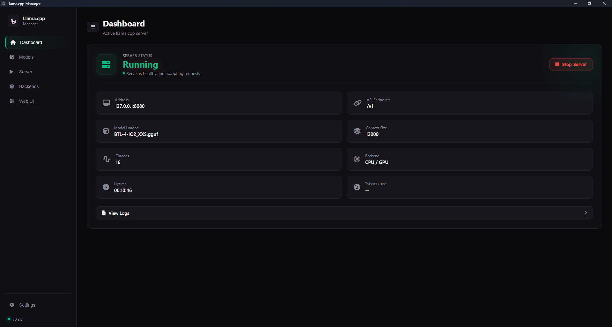
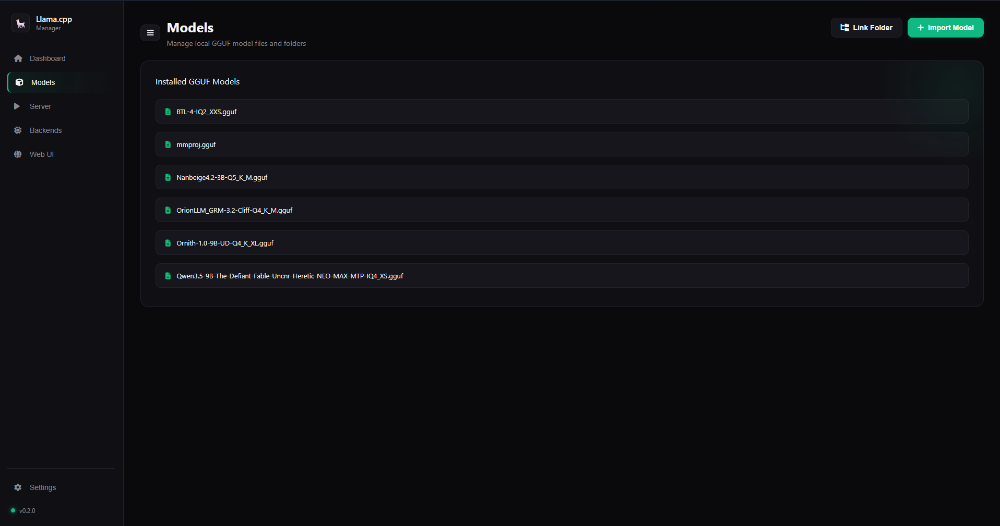

<div align="center">

# Llama.cpp Manager

**A cross-platform desktop app for downloading, configuring, and running [llama.cpp](https://github.com/ggerganov/llama.cpp) locally — no terminal required.**

Built with Electron, works on **Windows** and **Linux**.



[](LICENSE)

[](https://www.electronjs.org/)

</div>

---

## 🚀 What is it?

Llama.cpp Manager is a cross-platform desktop GUI that takes the pain out of running [llama.cpp](https://github.com/ggerganov/llama.cpp) and its bundled `llama-server` web UI. It handles everything through a clean interface:

- Downloads and installs llama.cpp releases automatically
- Links to an existing llama.cpp installation
- Import GGUF models or link a whole models folder
- Configures ports, context size, GPU layers, and extra server arguments
- Starts and stops the server from a live dashboard
- Streams server logs and status in real time
- Opens the built-in llama.cpp Web UI inside the app
- Light, dark, midnight, and glass themes

---

## ✨ Features

- 🛒 **One-click install** — pulls the latest llama.cpp release from GitHub
- 📦 **Link existing builds** — point the app at a folder containing `llama-server`
- 🧠 **Model manager** — import GGUF files or symlink an entire models directory
- 🎛️ **Full server config** — port, context size (`-c`), GPU layers (`-ngl`), and extra args
- ▶️ **Run/stop** — start and stop `llama-server` from the dashboard
- 🖥️ **Built-in Web UI** — chat with your model inside the app
- 🎨 **4 themes** — light, dark, midnight, and glass
- 🪟 **Cross-platform** — Windows 10+ and Linux

---

## 📸 Screenshots

| | |
|---|---|
|  |  |
| *Dashboard & live server status* | *Backends & updates* |
|  |  |
| *GGUF model manager* | *Embedded llama.cpp Web UI* |

---

## ⬇️ Installation

Get the latest portable executable from the **[Releases](https://github.com/bunnywaffle/Llama-cpp-manager/releases)** page.

> **Tip:** The app can download a compatible llama.cpp release for you — or you can link an
> existing installation from the **Backends** section.

---

## 🚦 Getting Started

1. Download the portable executable from [Releases](https://github.com/bunnywaffle/Llama-cpp-manager/releases).
2. Launch **Llama.cpp Manager**.
3. Open **Backends** → install llama.cpp, or link an existing folder.
4. Open **Models** → add a GGUF model (or link a models folder).
5. Select the model and adjust the server settings.
6. Start the server from the **Dashboard** or **Server** section.
7. Open **Web UI** to use the embedded chat interface.

---

## 🛠️ Development

### Install dependencies

```bash
npm install
```

### Run from source

```bash
npm start
```

### Build a release

```bash
npm run build        # installer / packaged app
npm run build-portable   # standalone portable executable
```

Generated files go into the `dist/` directory. Build output and `node_modules/` are kept out
of the source repository; the portable executable is attached to each GitHub release.

---

## 📁 Project structure

| File | Purpose |
|------|---------|
| `main.js` | Electron main process — IPC handlers, `llama-server` process management, downloads, and file operations |
| `index.html` | Application interface and renderer-side logic |
| `package.json` | Project metadata, dependencies, and build configuration |
| `screenshots/` | App screenshots used in this README |
| `LICENSE` | MIT license |

---

## 💬 Feedback & Support

Open an [issue](https://github.com/bunnywaffle/Llama-cpp-manager/issues) for bug reports,
feature requests, or questions.

---

## ⚠️ Third-party software

Llama.cpp Manager manages and runs [llama.cpp](https://github.com/ggerganov/llama.cpp). llama.cpp
and any downloaded model (GGUF) files are subject to their own licenses and terms — always check
the license of a model before using or distributing it.

## 📄 License

This project is licensed under the [MIT License](LICENSE).